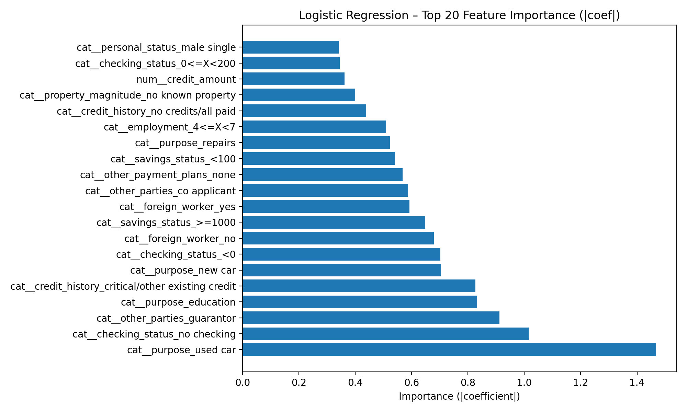

# Credit Risk Scoring
## Scoring de risque crédit avec seuils de décision métier


[](https://pdi-credit-risk-ml-mbn4mquhua-ew.a.run.app)

---

**🇫🇷 Projet de fin de formation – Développeur orienté IA**

Scoring de risque crédit basé sur le dataset **credit-g** (OpenML), développé selon la méthodologie **CRISP-DM** et déployé en production sur **Google Cloud Run** via CI/CD GitHub Actions.

## Objectifs

- Explorer et préparer les données **(EDA)**
- Entraîner un modèle de machine learning pour prédire le risque de défaut
- Exposer le modèle via une **API Flask**
- Proposer une **interface web métier** pour le scoring client
- Mettre en œuvre des **bonnes pratiques professionnelles** :
  - formatage du code avec **black**
  - linting avec **ruff**
  - hooks **pre-commit**
  - tests automatisés avec **pytest**
  - conteneurisation **Docker**
  - déploiement **Cloud Run** (keyless via **WIF**)

## Architecture du projet

```text
src/
 ├── api/                # API Flask
 ├── credit_g_ml/        # Pipeline ML (data, preprocessing, modeling)
scripts/                 # Entraînement et téléchargement du dataset
ui/                      # Interface web (dashboard)
data/                    # Données (téléchargées au build)
models/                  # Modèle entraîné (dans l’image Docker)
reports/                 # Résultats & visualisations
tests/                   # Tests unitaires
```

## Résultats – Modèle baseline

Le modèle baseline (Logistic Regression) atteint :

- ROC AUC ≈ 0.78
- Bon rappel sur la classe "bad" (objectif métier prioritaire)

Rapports disponibles :
- `reports/baseline_logistic_regression.md`
- `reports/roc_curve_logistic_regression.png`

## Model v2 → Model v3 — Business Decision Thresholds

### Contexte (Model v2)

Le Model v2 introduit une comparaison de plusieurs modèles
(Logistic Regression, Random Forest, HistGradientBoosting) sur un même split, avec un préprocessing identique.

Bien que certains modèles améliorent légèrement le ROC AUC ou la précision,
le score retourné reste probabiliste (P(bad)), ce qui pose une question clé :

> Comment transformer une probabilité en décision métier exploitable ?

### Problématique métier

Dans un contexte de scoring crédit, une décision binaire (accept / reject)
est souvent trop simpliste.

Les équipes métier ont généralement besoin :

- d’un refus automatique pour les dossiers très risqués,
- d’une acceptation automatique pour les dossiers très sûrs,
- d’une zone grise nécessitant une revue humaine.

## Introduction des seuils métier (Model v3)

Le Model v3 ne change pas le modèle de machine learning,
mais ajoute une couche de décision métier explicite basée sur deux seuils :

| Seuil                     | Rôle                                 |
| ------------------------- | ------------------------------------ |
| `A` – seuil d’acceptation | En dessous → acceptation automatique |
| `R` – seuil de rejet      | Au-dessus → rejet automatique        |

Avec la règle suivante :

- ACCEPT si P(bad) < A
- REVIEW si A ≤ P(bad) < R
- REJECT si P(bad) ≥ R

Exemple (issus de l’analyse coût métier) :

| Seuil | Valeur |
| ----- | ------ |
| A     | 0.15   |
| R     | 0.50   |

### Seuils optimaux (analyse coût)

Une analyse coût simple (pondération FN / FP) a conduit au seuil optimal suivant :

```text
Seuil optimal ≈ 0.15
Coût total = 114
FN = 3
FP = 99
```

Ce seuil devient naturellement le seuil d’acceptation (A),
tandis que le seuil de rejet (R) est fixé plus haut pour sécuriser les décisions.

### Visualisation dans l’UI

L’interface met en évidence :

- le score P(bad),
- les seuils A (accept) et R (reject),
- la décision métier finale (ACCEPT / REVIEW / REJECT),
- une séparation visuelle claire entre :
  - risque modèle (informatif),
  - règle métier (décision).

Le modèle ne décide pas seul :
il fournit un score, la décision reste pilotée par la stratégie métier.

### Message clé

> Le machine learning prédit un risque,<br>
> le métier décide à l’aide de règles explicites.

Cette approche rend le système :

- interprétable,
- auditable,
- facilement ajustable sans réentraîner le modèle.

## Feature Importance (interprétabilité du modèle)

Afin d’améliorer la compréhension du modèle, une analyse des **coefficients de la Logistic Regression**
a été réalisée.

La magnitude absolue des coefficients (`|coef|`) est utilisée comme **proxy d’importance** :
- plus |coef| est élevé, plus la variable influence la probabilité de défaut,
- le signe du coefficient indique la direction :
  - coefficient positif → augmente le risque (*bad*),
  - coefficient négatif → diminue le risque.

Cette importance est **indicative** et dépend :
- du prétraitement (standardisation, one-hot encoding),
- des corrélations entre variables.
Elle ne constitue pas une règle métier.

### Top 20 variables les plus influentes



Les valeurs détaillées sont disponibles ici :
- `reports/feature_importance_logreg_top20.csv`

### Message clé

> “Les variables les plus influentes aident à comprendre le score,<br>
> mais la décision finale repose exclusivement sur des seuils métier explicites<br>
> afin de garantir traçabilité et gouvernance.”

## API – Credit Risk Scoring

### Démarrage local

Activer l’environnement conda :

```bash
conda activate pdi-credit-risk-ml
```

Lancer l’API :

```bash
export PYTHONPATH=src
python -m api.app
```

API disponible sur :

```cpp
http://127.0.0.1:5001
```

### Endpoint de santé

```http
GET /health
```

```bash
curl http://127.0.0.1:5001/health
```

Réponse :

```json
{
  "status": "ok"
}
```

### Endpoint de prédiction

```http
POST /predict
```

Exemple de requête :

```bash
curl -X POST http://127.0.0.1:5001/predict \
  -H "Content-Type: application/json" \
  -d '{
    "duration": 24,
    "credit_amount": 5000,
    "installment_commitment": 3,
    "residence_since": 4,
    "age": 45,
    "existing_credits": 2,
    "num_dependents": 1,
    "checking_status": "0<=X<200",
    "credit_history": "existing paid",
    "purpose": "new car",
    "savings_status": "500<=X<1000",
    "employment": "4<=X<7",
    "personal_status": "female div/dep/mar",
    "other_parties": "guarantor",
    "property_magnitude": "car",
    "other_payment_plans": "bank",
    "housing": "rent",
    "job": "unskilled resident",
    "own_telephone": "none",
    "foreign_worker": "yes"
  }'
```

Exemple de réponse :

```json
{
  "label": "bad",
  "probability_bad": 0.7302879499577739,
  "probability_good": 0.26971205004222615,
  "risk_level": "high"
}
```

Champs retournés :

- `label` : classe prédite (`good` ou `bad`)
- `probability_bad` : probabilité de défaut
- `probability_good` : probabilité de non défaut
- `risk_level` :
  - `low` : risque faible
  - `medium` : risque modéré
  - `high` : risque élevé

> Le modèle fournit un **score probabiliste**.<br>
> La décision finale est pilotée par **des règles métier explicites** (seuils configurables).

### Validation des entrées

Les entrées sont validées côté API :

- types des champs
- bornes numériques
- présence obligatoire de toutes les features

En cas d’erreur → réponse **HTTP 422** avec détail.

## Exécution avec Docker

### Build

```bash
docker build -t pdi-credit-risk-ml .
```

### Run

```bash
docker run --rm -p 5001:5000 -e PORT=5000 pdi-credit-risk-ml
```

Accès :

- UI: http://127.0.0.1:5001/
- Health: http://127.0.0.1:5001/health
- Demo profiles:
  - /demo/low
  - /demo/medium
  - /demo/high

## Sécurité API (minimaliste)

L’endpoint /predict est protégé par un token via variable d’environnement.

### Header requis

```http
X-API-TOKEN: your-api-token
```

Exemple :
```bash
curl -X POST https://pdi-credit-risk-ml-mbn4mquhua-ew.a.run.app/predict \
  -H "Content-Type: application/json" \
  -H "X-API-TOKEN: <your-api-token>" \
  -d '{...}'
```

L’UI reste publique, seule l’API est protégée.

## Live demo – Cloud Run

https://pdi-credit-risk-ml-mbn4mquhua-ew.a.run.app

### Script de démonstration (≈ 3 minutes)

1. Contexte
    - Cas réel de scoring crédit
    - Modèle ML + API + dashboard métier
2. Risque faible
    - /demo/full/low
    - Acceptation immédiate
3. Cas intermédiaire
    - /demo/full/medium
    - Décision dépendante du seuil métier
4. Risque élevé
    - /demo/full/high
    - Rejet automatique
    - Visualisation claire (jauge, badges)

### Message clé

> Le modèle assiste la décision,<br>
> mais **la décision finale reste métier**.

---

👤 Auteur<br>
Franck Ngaha<br>
Projet de développement individuel – Développeur orienté IA<br>
© 2026

---

# Credit Risk Scoring
## Credit Risk Scoring with Business Decision Thresholds

**🇬🇧 End-of-training project – AI-Oriented Developer**

Credit risk scoring based on the **credit-g** dataset (OpenML), developed according to the **CRISP-DM** methodology and deployed in production on **Google Cloud Run** via GitHub Actions CI/CD.

## Project Goals

- Explore and prepare data **(EDA)**
- Train a machine learning model to predict credit default risk
- Expose the model through a **Flask API**
- Provide a simple business-oriented web interface for client scoring

- Apply professional best practices:
  - code formatting with **black**
  - linting with **ruff**
  - **pre-commit** hooks
  - automated testing with **pytest**
  - **Docker** containerization
  - **Cloud Run** deployment (keyless via **WIF**)

## Project Architecture

```text
src/
 ├── api/                # Flask API
 ├── credit_g_ml/        # ML pipeline (data, preprocessing, modeling)
scripts/                 # Dataset download & model training
ui/                      # Web UI (dashboard)
data/                    # Data (downloaded at build time)
models/                  # Trained model (inside the Docker image)
reports/                 # Metrics & visualizations
tests/                   # Unit tests
```

## Results – Baseline Model

The baseline model (Logistic Regression) achieves:

- ROC AUC ≈ 0.78
- Strong recall on the bad class (business priority)

Available reports:
- `reports/baseline_logistic_regression.md`
- `reports/roc_curve_logistic_regression.png`

## Model v2 → Model v3 — Business Decision Thresholds

### Context (Model v2)

Model v2 compares several algorithms
(Logistic Regression, Random Forest, HistGradientBoosting)
using the same data split and identical preprocessing.

While some models slightly improve ROC AUC or precision,
the output remains a probability score (P(bad)), raising a key question:

> How do we turn a probability into a business-ready decision?

### Business challenge

In credit risk scoring, a strict accept / reject decision is often too crude.

Business teams usually require:

- automatic rejection for very risky applications
- automatic acceptance for very safe ones
- an intermediate manual review zone

### Business decision thresholds (Model v3)

Model v3 does not change the ML model itself,
but introduces an explicit business decision layer
based on two thresholds:

| Threshold                  | Role                         |
| -------------------------- | ---------------------------- |
| `A` – acceptance threshold | Below → automatic acceptance |
| `R` – rejection threshold  | Above → automatic rejection  |

Decision rule:

- ACCEPT if P(bad) < A
- REVIEW if A ≤ P(bad) < R
- REJECT if P(bad) ≥ R

Example (derived from cost analysis):

| Threshold | Value  |
| --------- | ------ |
| A         | 0.15   |
| R         | 0.35   |

### Optimal threshold (cost-based analysis)

A simple cost-sensitive analysis (FN vs FP weighting) led to:

```text
Optimal threshold ≈ 0.15
Total cost = 114
FN = 3
FP = 99
```

This value naturally becomes the acceptance threshold (A),
while the rejection threshold (R) is set higher for risk control.

### UI visualization

The UI clearly displays:

- P(bad) score,
- accept / reject thresholds,
- final business decision (ACCEPT / REVIEW / REJECT),
- a clean separation between:
  - model risk (informational),
  - business rules (decision).

The model does not decide alone:
it provides a score, while business rules drive the final decision.

### Key takeaway

> Machine learning predicts risk.
> Business rules make the decision.

This approach ensures the system is:

- interpretable,
- auditable,
- easy to adapt without retraining the model.

## Feature Importance (Model Interpretability)

To improve model understanding, an analysis of the **Logistic Regression coefficients** was performed.

The absolute magnitude of the coefficients (`|coef|`) is used as an **importance proxy**:

- the higher the |coef|, the stronger the influence on the default probability,
- the sign of the coefficient indicates the direction:
  - positive coefficient → increases the risk (*bad*),
  - negative coefficient → decreases the risk (good).

This importance is **indicative only** and depends on:

- the preprocessing pipeline (standardization, one-hot encoding),
- the correlations between input variables.

It does not represent a business decision rule.

### Top 20 Most Influential Variables


Detailed values ​​are available here:

- `reports/feature_importance_logreg_top20.csv`

### Key takeaway

> The model explains the risk,<br>
> the business rules make the decision.

Feature importance helps understand why a score is high or low,
but the final credit decision is driven exclusively by explicit business thresholds
(Accept / Review / Reject), ensuring transparency and governance.

## API – Credit Risk Scoring

### Run locally

Activate the conda environment:

```bash
conda activate pdi-credit-risk-ml
```

Start the API:

```bash
export PYTHONPATH=src
PORT=5001 python -m api.app
```

The API runs on:

```cpp
http://127.0.0.1:5001
```

### Health endpoint

```http
GET /health
```

```bash
curl http://127.0.0.1:5001/health
```

Expected response:

```json
{
  "status": "ok"
}
```

### Prediction endpoint

```http
POST /predict
```

Example request:

```bash
curl -X POST http://127.0.0.1:5001/predict \
  -H "Content-Type: application/json" \
  -d '{
    "duration": 24,
    "credit_amount": 5000,
    "installment_commitment": 3,
    "residence_since": 4,
    "age": 45,
    "existing_credits": 2,
    "num_dependents": 1,
    "checking_status": "0<=X<200",
    "credit_history": "existing paid",
    "purpose": "new car",
    "savings_status": "500<=X<1000",
    "employment": "4<=X<7",
    "personal_status": "female div/dep/mar",
    "other_parties": "guarantor",
    "property_magnitude": "car",
    "other_payment_plans": "bank",
    "housing": "rent",
    "job": "unskilled resident",
    "own_telephone": "none",
    "foreign_worker": "yes"
  }'
```

Expected response:

```json
{
  "label": "bad",
  "probability_bad": 0.7302879499577739,
  "probability_good": 0.26971205004222615,
  "risk_level": "high"
}
```

Response fields

- `label` : classe prédite (`good` ou `bad`)
- `probability_bad` : probabilité de défaut
- `probability_good` : probabilité de non défaut
- `risk_level` :
  - `low` : risque faible
  - `medium` : risque modéré
  - `high` : risque élevé

> Le modèle fournit un **score probabiliste**.<br>
> La décision finale est pilotée par **des règles métier explicites** (seuils configurables).

### Input validation

All inputs are validated at API level:
- data types
- numeric ranges
- mandatory feature presence

Invalid requests return HTTP 422 with details.

## Run with Docker

### Build

```bash
docker build -t pdi-credit-risk-ml .
```

### Run

```bash
docker run --rm -p 5001:5000 -e PORT=5000 pdi-credit-risk-ml
```

Access:

- UI: http://127.0.0.1:5001/
- Health: http://127.0.0.1:5001/health
- Demo profiles:
  - /demo/low
  - /demo/medium
  - /demo/high

## API Security (minimal)

The `/predict` endpoint is protected by an **API token** provided via environment variable.

### Required header

```http
X-API-TOKEN: your-api-token
```

Example:
```bash
curl -X POST https://pdi-credit-risk-ml-mbn4mquhua-ew.a.run.app/predict \
  -H "Content-Type: application/json" \
  -H "X-API-TOKEN: <your-api-token>" \
  -d '{...}'
```

The UI is public, only the prediction API is secured.

## Live demo – Cloud Run

https://pdi-credit-risk-ml-mbn4mquhua-ew.a.run.app

### Demo script (≈ 3 minutes)

1. Context
    - Real-world credit scoring use case
    - ML model + API + business dashboard
2. Low risk case
    - /demo/full/low
    - Immediate approval
3. Medium risk case
    - /demo/full/medium
    - Decision depends on business threshold
4. High risk case
    - /demo/full/high
    - Automatic rejection
    - Clear visualization (gauge, badges)

### Key message

> The model assists decision-making,<br>
> but **the final decision remains business-driven**.

---

👤 Author<br>
Franck Ngaha<br>
Individual development project – AI-oriented Developer<br>
© 2026
